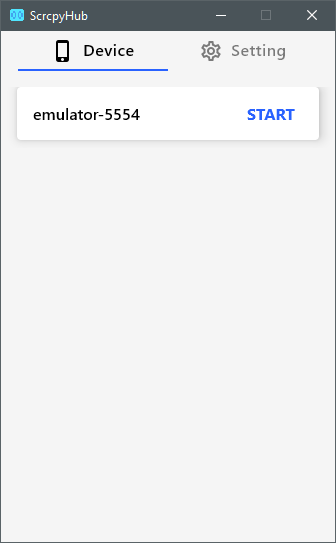

# ScrcpyHub

ScrcpyHub is a GUI application to use [scrcpy](https://github.com/Genymobile/scrcpy). [scrcpy](https://github.com/Genymobile/scrcpy) is a tool to mirror the android screen.



# Features

- Support mirroring conrol. (Start / Stop)
- Support multi android device mirroring.
- Support Windows10 or Ubuntu or Mac OS

# Install

Install adb and scrcpy, ScrcpyHub.

## Mac OS

```
TODO
```

## Windows 10

```
TODO
```

## Ubuntu

```
TODO
```

# Develop

```
TODO
```

# References

- [Compose for Desktop](https://www.jetbrains.com/lp/compose/)
- [scrcpy](https://github.com/Genymobile/scrcpy)
