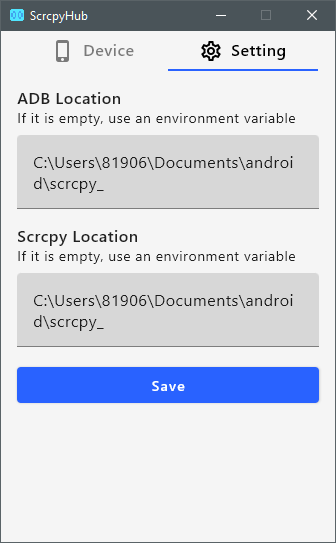

# ScrcpyHub

ScrcpyHub is a GUI application to use [scrcpy](https://github.com/Genymobile/scrcpy).    
[scrcpy](https://github.com/Genymobile/scrcpy) is a tool to mirror the android screen.

|  |  | 
| --- | ---- |

- Created with [Compose for Desktop](https://github.com/JetBrains/compose-jb)
- Support mirroring conrol. (Start / Stop)
- Support multi android device mirroring.
- Support Windows10 or Ubuntu or Mac OS

# Install

Install adb and scrcpy, ScrcpyHub.

## Mac OS

You need adb and scrcpy, accesible from your PATH, If you don't have it yet.

```
brew install android-platform-tools
brew install scrcpy
```

Download and launch ScrcpyHub.
Mac OS application download [here](https://github.com/kaleidot725/scrcpy-hub/releases/tag/v1.0.0)

## Windows 10

You need adb and scrcpy, accesible from your PATH, If you don't have it yet.

```
choco install adb
choco install scrcpy
```

Download and launch ScrcpyHub.
Windows application download [here](https://github.com/kaleidot725/scrcpy-hub/releases/tag/v1.0.0)

# References

- [Compose for Desktop](https://www.jetbrains.com/lp/compose/)
- [scrcpy](https://github.com/Genymobile/scrcpy)
