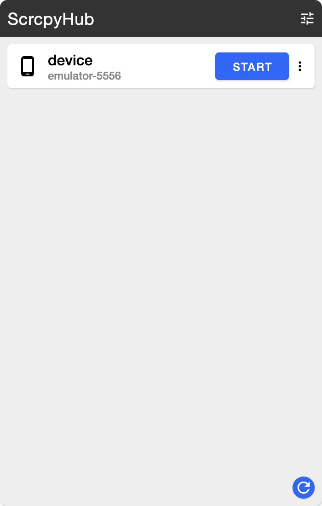
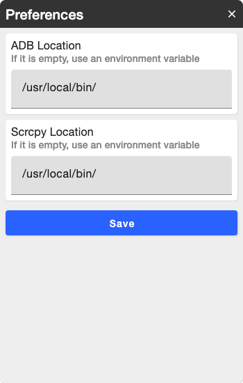
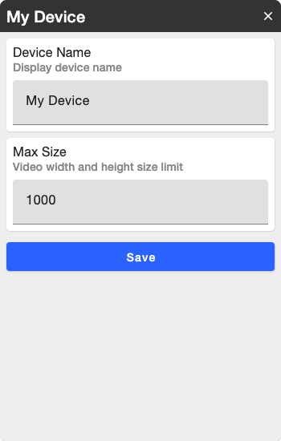

# 🐻‍❄️ ScrcpyHub

ScrcpyHub is a GUI application to use [scrcpy](https://github.com/Genymobile/scrcpy).    
[scrcpy](https://github.com/Genymobile/scrcpy) is a tool to mirror the android screen.


# ✨ Feature

- Support Windows10 or Mac OS.

- Control mirroing (Start / Stop).

- Mirror multi android device.

- Save Screenshot.

- Support Tary Menu.

  



# ⬇️ Install

Install adb and scrcpy, ScrcpyHub.

## 💻 Mac OS

You need adb and scrcpy, accesible from your PATH, If you don't have it yet.

```
brew install android-platform-tools
brew install scrcpy
```
Download and launch ScrcpyHub. Mac application download [here ](https://github.com/kaleidot725/scrcpy-hub/releases/tag/v1.2.3)and install.

## 💻 Windows 10

You need adb and scrcpy, accessible from your PATH, If you don't have it yet.

```
choco install adb
choco install scrcpy
```

Download and launch ScrcpyHub. Windows application download [here](https://github.com/kaleidot725/scrcpy-hub/releases/tag/v1.2.3) and install.

# 🎫 Licence

The GNU General Public License v3.0 (GPLv3)
