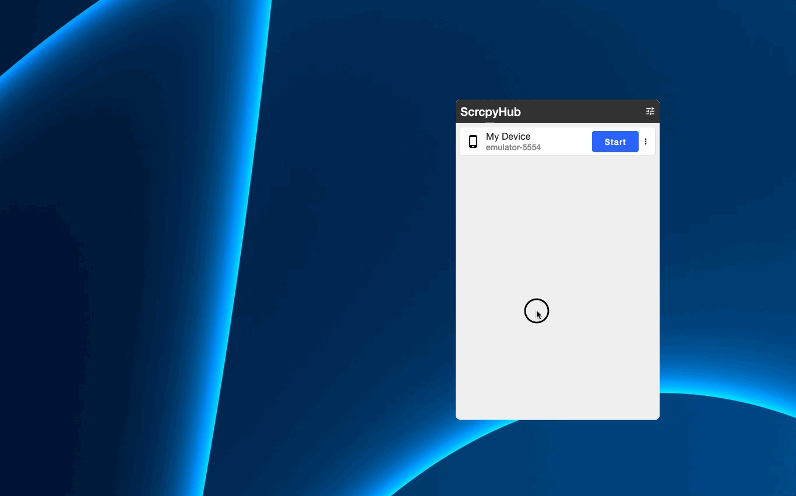

#  ScrcpyHub

ScrcpyHub is a GUI application to mirror android screens.   
ScrcpyHub uses [scrcpy](https://github.com/Genymobile/scrcpy). [scrcpy](https://github.com/Genymobile/scrcpy) is a
mirroring android command tool.



# ✨ Feature

- Support Windows10/11, Linux, macOS. 🖥️

- Support light theme and dark theme. 🖼️

- Control mirroing (Start / Stop). 🪞

- Mirror multi android devices. 📱

- Save screenshots. 📸

- Record movies. 🎥

- Support tary menu. 📥
  - Display and hide window.
  - Enable always on top.

# ⬇️ Install

Install adb and scrcpy, ScrcpyHub.

## 💻 Windows 10/11

1. Download [here](https://github.com/Genymobile/scrcpy#windows) and install scrcpy somewhere.
2. Download [here](https://github.com/kaleidot725/scrcpy-hub/releases/tag/v1.7.0) and launch ScrcpyHub.
3. Open ScrcpyHub Preferences.
4. Input adb and scrcpy location, save settings.

#### WARNING: Not recommend Chocolately.

ScrcpyHub doesn't work mirroring start and stop if you install scrcpy through Chocolately.

## 💻 Linux(Ubuntu)

1. Download [here](https://github.com/Genymobile/scrcpy#windows) and install scrcpy somewhere.
2. Download [here](https://github.com/kaleidot725/scrcpy-hub/releases/tag/v1.7.0) and install ScrcpHub.

```
sudo dpkg -i scrcpyhub_1.7.0-1_amd64.deb
```

3. Launch ScrcpyHub, open Preferences.

```
/opt/scrcpyhub/bin/ScrcpyHub
```

4. Input adb and scrcpy location, save settings.

## 💻 macOS

1. Install android-platform-tools and scrcpy.

```
brew install android-platform-tools
brew install scrcpy
```

2. Download [here](https://github.com/kaleidot725/scrcpy-hub/releases/tag/v1.7.0) and launch ScrcpyHub.
3. Open ScrcpyHub Preferences.
4. Input adb and scrcpy location, save settings.

# 🎫 Licence

The GNU General Public License v3.0 (GPLv3)
