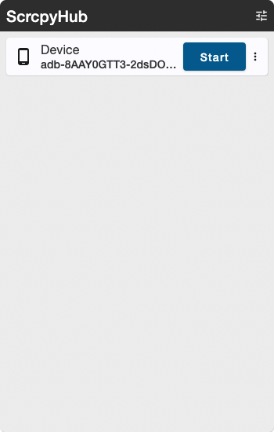
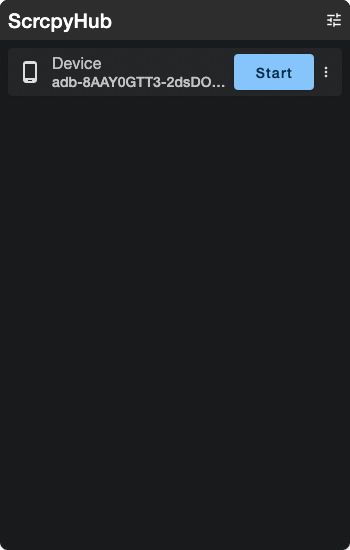
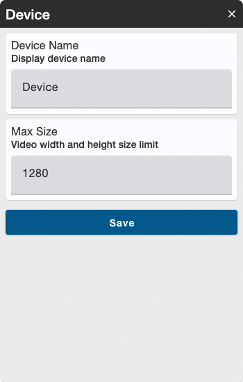
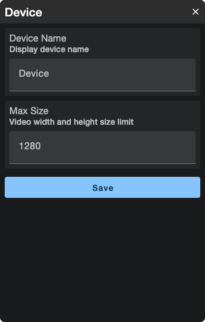
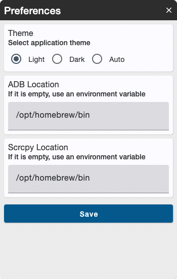
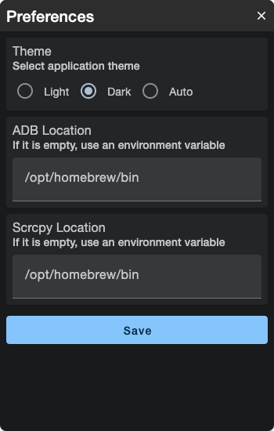

# 🐻‍❄️ ScrcpyHub

ScrcpyHub is a GUI application to mirror android screen.   
ScrcpyHub use [scrcpy](https://github.com/Genymobile/scrcpy). [scrcpy](https://github.com/Genymobile/scrcpy) is a mirroring android command tool.


# ✨ Feature

- Support Windows10/11, Linux, macOS. 🖥️ 

- Support light theme and dark theme. 🖼️

- Control mirroing (Start / Stop). 🪞

- Mirror multi android device. 📱

- Save Screenshot. 📸

- Record Movie. 🎥

- Support Tary Menu. 📥

  


# ⬇️ Install

Install adb and scrcpy, ScrcpyHub.

## 💻 Windows 10/11

1. Download [here](https://github.com/Genymobile/scrcpy#windows) and install scrcpy somewhere.
2. Download [here](https://github.com/kaleidot725/scrcpy-hub/releases/tag/v1.5.0) and launch ScrcpyHub.
3. Open ScrcpyHub Preferences.
4. Input adb and scrcpy location, save settings.

#### WARNING: Not recommend Chocolately.

ScrcpyHub doesn't work mirroring start and stop when install scrcpy throught Chocolately.

## 💻 Linux(Ubuntu)

1. Download [here](https://github.com/Genymobile/scrcpy#windows) and install scrcpy somewhere.
2. Download [here](https://github.com/kaleidot725/scrcpy-hub/releases/tag/v1.5.0) and install ScrcpHub.

```
sudo dpkg -i scrcpyhub_1.5.0_amd64.deb
```

3. Launch ScrcpyHub, open Preferences.

```
/opt/scrcpyhub/bin/ScrcpyHub
```

4. Input adb and scrcpy location, save settings.

## 💻 macOS

1. Install android-platform-tools and scrcpy.

```
brew install android-platform-tools
brew install scrcpy
```
2. Download [here](https://github.com/kaleidot725/scrcpy-hub/releases/tag/v1.5.0) and launch ScrcpyHub.
3. Open ScrcpyHub Preferences.
4. Input adb and scrcpy location, save settings.


# 🎫 Licence

The GNU General Public License v3.0 (GPLv3)
n